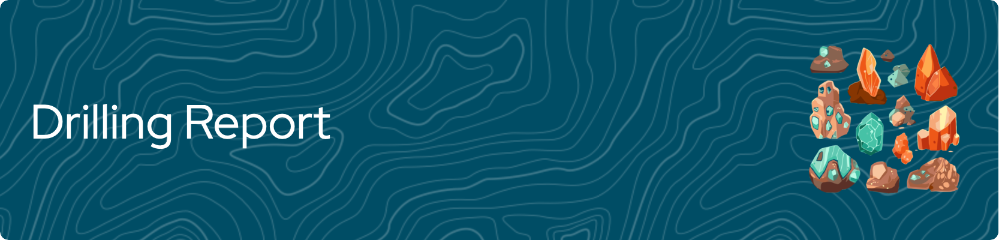

##  About

Drilling Report Aplication founded blblbla

## Instalastion

To get this project, you can clone it by running the following code:

    git@github.com:zuhririzqi/Laporan-Pengeboran.git

##  Project Organization

The directory structure of IndoMarket project looks like this:

        ├── Readme.md               -- The top-level README for developers using this project.
        ├── data                    -- Drilling Report Database
        ├── docs                    -- Detailed Presentation
        ├── requirements.txt        -- The requirements file for reproducing the analysis environment
        └── src                     -- Source code for this program
          

